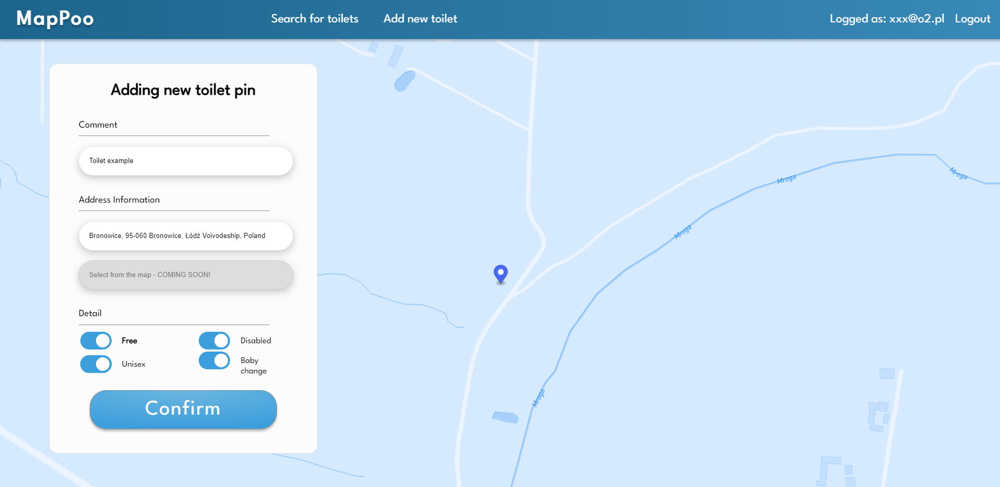
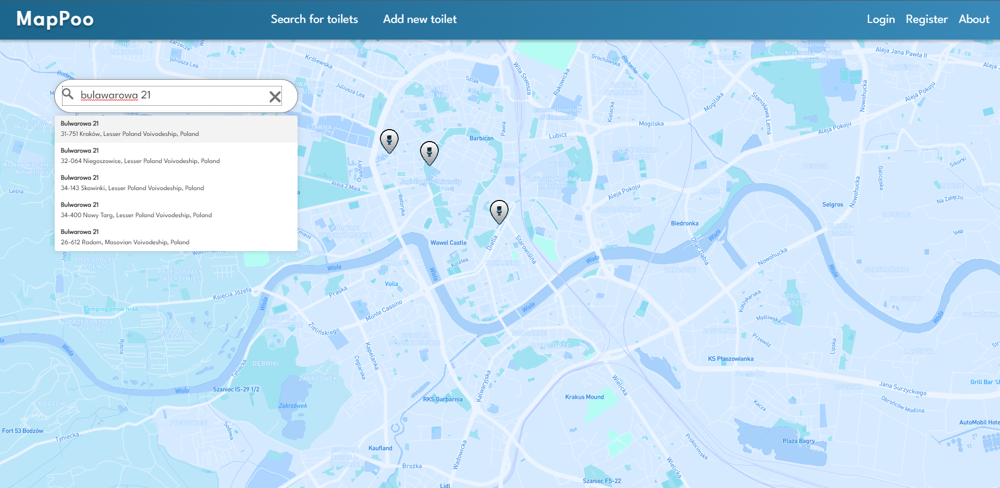

# 🗺 MaPoo 💩

MaPoo is a Web application made with PHP, MapBox and Google Maps API. 
It allows people to share places with free toilets among each others. Main purpose of the app was to make traveling easier.

## Table of contents
* 🎯 [General info](#general-info)
* 🎯 [Technologies](#technologies)
* 🎯 [Reqirements](#requirements)
* 🎯 [Setup](#setup)

## General info

The app consists of two main componenets:

🔎🚽 Searching for the toilet: 

➕🚽 Adding new toilet:

Database diagram:

## 👾 Technologies

*👉 PHP:7.4.3
*👉 JavaScript
*👉 HTML
*👉 NGINX:1.17.8
*👉 Docker
*👉 Heroku pipeline

## 🚩 Requirements:
* [Docker](https://docs.docker.com/engine/install/) installed locally
* own Postgresql database (you can get one for free on [Heroku](heroku.com) )
* own [Google Maps API](https://developers.google.com/maps) service
* Credentials for both services needs to be applied to [config.php](config.php) file.

## 🏗️ Setup

If requirements are met, you can run this project using docker compose. Download the repo and run following command:

'docker compose up'

