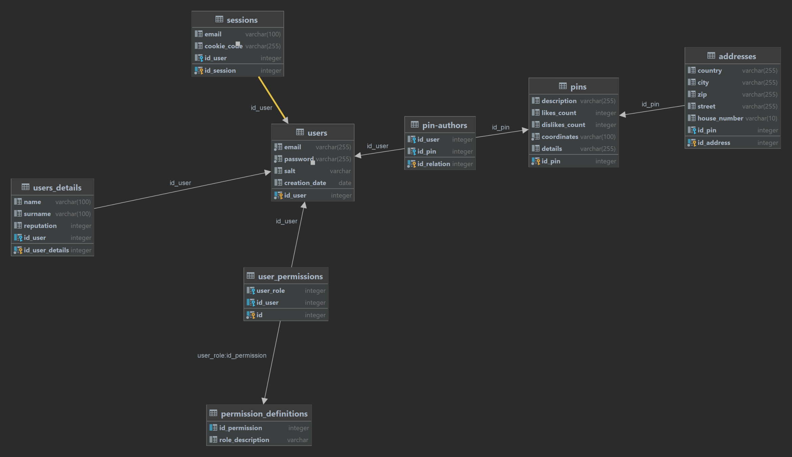

✔️DOKUMENTACJE W README.MD

Available [here](README.md). I used standard documentation template which covers: 
* app purpose
* tech stack
* requirements and guide how to run the app locally

✔️KOD NAPISANY OBIEKTOWO (CZĘŚĆ BACKENDOWA)️

Project is based on PHP Classes and uses MVC design patter:
* [Model](src/models)
* [View](public/views) 
* [Controller](src/controllers)  

all connections to the db are covered under [Repository](src/repository) directory.

✔️DIAGRAM ERD

Available [here](examples/diagrams) in few formats

✔️GIT

I tried to apply as much commits as possible, each new functionality should be added in separate commit.  
All comits on main branch are availabe [here](https://github.com/sm-xh/MaPoo/commits/main).

⚠️️ REALIZACJA TEMATU

I covered all functionalities covered in the prototype except for responsive view for mobiles.

✔️HTML

Elements which were common for more than one view were added to [common](public/common) directory and applied to the HTML files.

Example:
1. [NavbarSelector](https://github.com/sm-xh/MaPoo/blob/main/public/views/login.php#L17) (it was delegated to Controller, since different users should have different navbars available)
2. [Head section of html](https://github.com/sm-xh/MaPoo/blob/main/public/views/login.php#L8)

✔️ POSTGRESQL

Heroku PostgreSQL used, all connections are available in [repository ](src/repository) directory.

[Example PDO connection](https://github.com/sm-xh/MaPoo/blob/main/src/repository/PlacesRepository.php#L24)

✔️ZŁOŻONOŚĆ BAZY DANYCH

Database diagram covers all requirements, database uses constraints for stored data.


✔️PHP

PHP in version 7.4.3-fpm-alpine3.11  was used.

✔️JAVA SCRIPT

Java script is used to:
* validate registration form, 
* to get pins from the db and process them on map, 
* to display messages,
* to change position of fixed search bar from mapbox.

⚠️ FETCH API (AJAX)  

Only [GET](https://github.com/sm-xh/MaPoo/blob/main/public/js/map.js#L17) was used.

✔️ DESIGN

I think it is pretty clean. There are some UX features which I wanted to fix, e.g. the navbar, but for this state of project I think it is sufficient.

❌ RESPONSYWNOŚĆ

App is not adjusted for phones. I used only scalable units in css like %, vh, em etc. though.

✔️ LOGOWANIE    

User can login using his email and password. Components used for that are:
1. [login()](https://github.com/sm-xh/MaPoo/blob/main/src/controllers/SecurityController.php#L20) function in [SecurityController](src/controllers/SecurityController.php)
2. [getuser()](https://github.com/sm-xh/MaPoo/blob/main/src/repository/UserRepository.php#L9)) function from [UserRepository](src/repository/UserRepository.php)
3. [User()](src/models/User.php) model

✔️ SESJA UŻYTKOWNIKA    

Session is based on cookies. After loggin in, the controller [sets the cookie](https://github.com/sm-xh/MaPoo/blob/main/src/controllers/SecurityController.php#L44). [Cookies Repository](src/repository/CookiesRepository.php) handles all functions related to adding/deleting the cookie from database and user browser.

✔  UPRAWNIENIA UŻYTKOWNIKÓW    

There are three main roles:
1. Admin - can add new pins to the map and also access the /admin view (which is currently empty)
2. User - can add new pins to the map
3. Disabled - means that user account was deleted and can't be accessed and used.
4. Not registered - can only use search view.

❌ ROLE UŻYTKOWNIKÓW

Roles were described in previous point, the access is verified when accessing the PHP view by functions from [Permission Controller](src/controllers/PermissionController.php)

✔️ WYLOGOWYWANIE

User when can use **Logout** button from his navbar to end session. When he does it, the cookie is removed from the database and his browser.

✔️ WIDOKI, WYZWALACZ/ FUNKCJE, TRANSAKCJE NA BAZIE DANYCH

1. [View](https://github.com/sm-xh/MaPoo/blob/main/src/repository/PlacesRepository.php#L15) is used when accessing the information about pin.
2. [Transaction](https://github.com/sm-xh/MaPoo/blob/main/src/repository/PlacesRepository.php#L27-L71) to add information about pin to three related tables.
3. Triggers/functions: when adding new user to the db, following trigger is used:
```
create function user_insert_trigger_fnc() returns trigger
   language plpgsql
   as
   $$
   DECLARE last_userId integer;

BEGIN


    SELECT max(id_user)
        INTO last_userId
        FROM users;

    INSERT INTO users_details (id_user) VALUES (last_userId);

    INSERT INTO user_permissions (user_role, id_user) VALUES (2, last_userId);

    RETURN NEW;

END;

$$;
```

✔️ AKCJE NA REFERENCJACH

Examples of such:
* [getUser()](https://github.com/sm-xh/MaPoo/blob/main/src/repository/UserRepository.php#L12-L13)
* [isUserAdmin()](https://github.com/sm-xh/MaPoo/blob/main/src/repository/PermissionRepository.php#L11)

✔️ BEZPIECZEŃSTWO

Passwords are hashed using [password_hash()](https://github.com/sm-xh/MaPoo/blob/main/src/controllers/SecurityController.php#L62) function.  
Is user is not supposed to access some content, he is being redirected to **/index?unauthorized** page by [Permission Controller](src/controllers/PermissionController.php)

✔️BRAK REPLIKACJI KODU

When some action was being used more than one time, I delegated it to function, e.g. [when accessing the correct Navbar](https://github.com/sm-xh/MaPoo/blob/main/src/controllers/SiteContentController.php#L5-L13)


✔️ CZYSTOŚĆ I PRZEJRZYSTOŚĆ KODU

Code uses proper formatting and I tried to make as clean as possible, but I could enter more comments.

✔️ BAZA DANYCH ZRZUCONA DO PLIKU .SQL

Available [here](examples/mapoo_2022_06_27-dump.sql)

SUMMARY = ~22/24